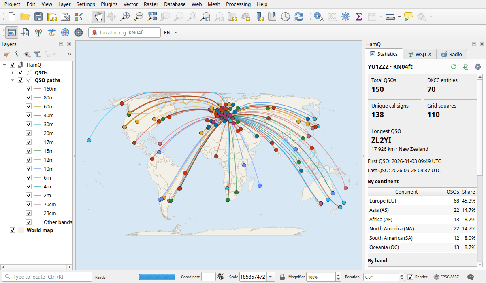
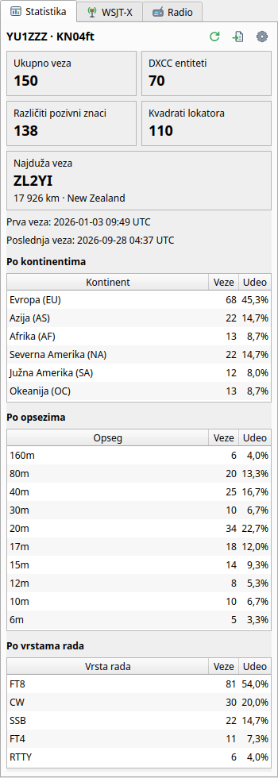
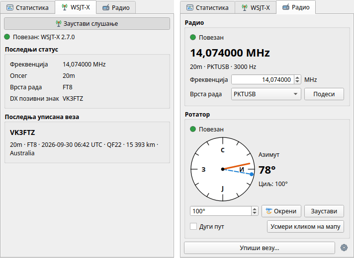
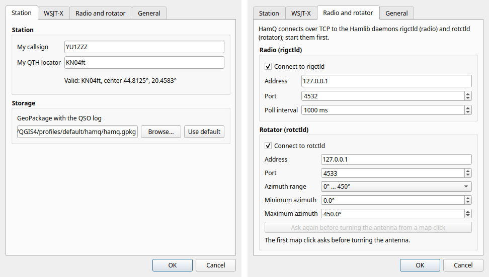
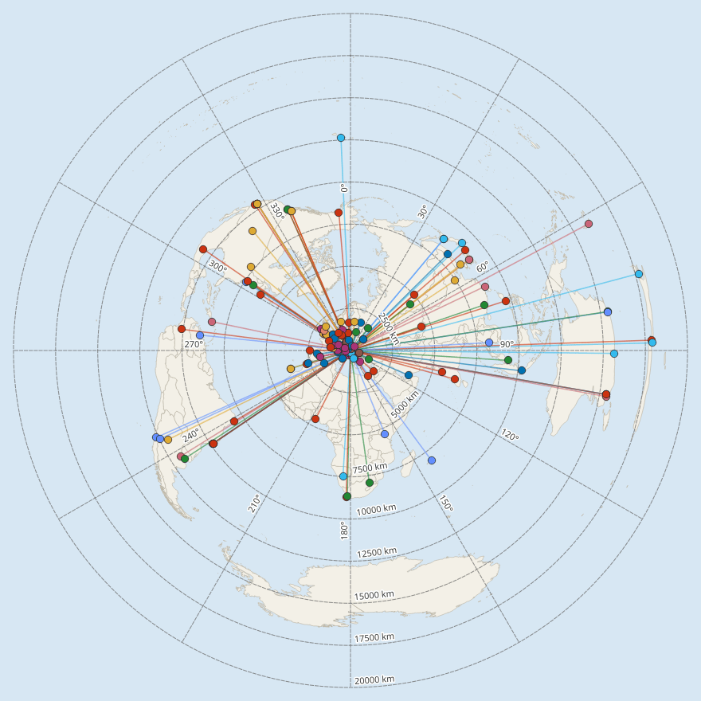

# HamQ

HamQ is a QGIS plugin for radio amateurs: Maidenhead (QTH) locators, your QSO log on
the map with geodesic paths, DXCC statistics, live QSOs from WSJT-X and JTDX, and
radio and rotator control through Hamlib. It runs on QGIS 3.34 and newer, QGIS 4.x
included, needs no extra Python packages, and speaks English, Srpski (latinica) and
Српски (ћирилица).

**[Uputstvo na srpskom je ispod.](#srpski)**



> **Status: 0.1.1, experimental.** The automated tests pass on QGIS 3.34, 3.40, 3.44,
> 4.0 and 4.2. The WSJT-X protocol was checked with datagrams captured from a real
> WSJT-X 2.7.0, and the radio and rotator part with the Hamlib 4.6 dummy devices, not
> yet with real radios and rotators on the air. Please tell what works with your station
> and what does not in the [issue tracker](https://github.com/vukovicvl/hamq/issues).

**Contents:** [Features](#features) · [Requirements](#requirements) ·
[Installation](#installation) · [First steps](#first-steps) ·
[WSJT-X and JTDX](#wsjt-x-and-jtdx) · [Radio and rotator](#radio-and-rotator-hamlib) ·
[Azimuthal map](#azimuthal-map) · [Language](#language) ·
[Data storage](#data-storage) · [Processing algorithms](#processing-algorithms) ·
[Troubleshooting](#troubleshooting) · [Development](#development) ·
[Credits and licence](#credits-and-licence) · [Srpski](#srpski)

## Features

- **Maidenhead locators** with 2, 4, 6 or 8 characters, both ways. Type a locator such
  as `KN04ft` into the toolbar field and press Enter: the map centres on that square
  and highlights it. Processing algorithms make points from locators and the locator
  grid (fields to extended squares) as a vector layer.
- **Your log on the map.** ADIF (`.adi`) logs from WSJT-X, JTDX, N1MM Logger+, Log4OM,
  QRZ.com, LoTW, Xlog and other loggers go into one GeoPackage, without duplicates.
  Every QSO is a point at the other station and a geodesic path from your QTH (split at
  the antimeridian), with distance and bearing, coloured by band with colour-blind-safe
  colours.
- **DXCC entity, continent, CQ and ITU zone** from the callsign, with the country file
  `cty.dat` by Jim Reisert, AD1C. HamQ downloads it with one click; it is never bundled.
- **Statistics panel:** QSOs, DXCC entities, unique callsigns, grid squares, the longest
  QSO, the first and the last QSO, and tables by continent, band and mode.
- **WSJT-X and JTDX live:** every QSO you log arrives over UDP and is on the map in
  about a second; the panel shows the dial frequency, mode and DX call.
- **Radio and rotator through Hamlib** (`rigctld`, `rotctld`): frequency and mode from
  the radio and back, the rotator's azimuth on a compass, turn and stop, turn the
  antenna by clicking the map (short or long path), and manual QSO entry with frequency
  and mode taken from the radio.
- **Azimuthal equidistant map** centred on your QTH, with distance rings and azimuth
  lines.
- **English and Serbian**, Latin or Cyrillic script, switched with one click without
  restarting QGIS: menus, panel, dialogs, Processing algorithms, layer names, field names
  and the band legend.

| The Statistics tab (Srpski, latinica) | The WSJT-X and Radio tabs (Српски, ћирилица) |
|---|---|
|  |  |

## Requirements

- QGIS 3.34 or newer, QGIS 4.x included (Qt5 or Qt6), on Linux, Windows or macOS.
- No extra Python packages: HamQ uses only what comes with QGIS.
- Optional: an internet connection once in a while for `cty.dat`; WSJT-X or JTDX for live
  QSOs; Hamlib 4 (`rigctld`, `rotctld`) for the radio and the rotator.

## Installation

### From the release zip

1. Download `hamq-0.1.1.zip` from the
   [releases page](https://github.com/vukovicvl/hamq/releases).
2. In QGIS: *Plugins > Manage and Install Plugins > Install from ZIP*, choose the file
   and click *Install Plugin*. QGIS asks you to confirm a plugin from outside its
   repository.
3. The *HamQ* toolbar, the *Plugins > HamQ* menu and the HamQ panel appear. The first
   toolbar button, *Show HamQ panel*, shows and hides the panel.

### From the QGIS plugin repository

Once HamQ is published on [plugins.qgis.org](https://plugins.qgis.org/): in *Plugins >
Manage and Install Plugins > Settings* tick *Show also experimental plugins* (0.x
versions are experimental), then search for *HamQ* under *All* and install it. Updates
then come through the plugin manager.

### For development: link the checkout

Clone the repository and link its `hamq` folder into the `python/plugins` folder of your
QGIS profile (the folder must be called `hamq`). QGIS 4 keeps its profiles in a `QGIS4`
folder, QGIS 3 in `QGIS3`; *Settings > User Profiles > Open Active Profile Folder*
shows yours.

Linux:

```bash
git clone https://github.com/vukovicvl/hamq.git
cd hamq
# QGIS 4.x
mkdir -p ~/.local/share/QGIS/QGIS4/profiles/default/python/plugins
ln -sfn "$PWD/hamq" ~/.local/share/QGIS/QGIS4/profiles/default/python/plugins/hamq
# QGIS 3.x
mkdir -p ~/.local/share/QGIS/QGIS3/profiles/default/python/plugins
ln -sfn "$PWD/hamq" ~/.local/share/QGIS/QGIS3/profiles/default/python/plugins/hamq
```

macOS (QGIS 3.x: `QGIS3` instead of `QGIS4`):

```bash
mkdir -p ~/Library/Application\ Support/QGIS/QGIS4/profiles/default/python/plugins
ln -sfn "$PWD/hamq" ~/Library/Application\ Support/QGIS/QGIS4/profiles/default/python/plugins/hamq
```

Windows, in a Command Prompt in the checkout (QGIS 3.x: `QGIS3` instead of `QGIS4`):

```bat
mkdir "%APPDATA%\QGIS\QGIS4\profiles\default\python\plugins"
mklink /J "%APPDATA%\QGIS\QGIS4\profiles\default\python\plugins\hamq" "%CD%\hamq"
```

`mklink /J` makes a directory junction and needs no administrator rights (`mklink /D`
makes a symbolic link and needs them, or Windows Developer Mode). Restart QGIS and enable
*HamQ* under *Plugins > Manage and Install Plugins > Installed* (with *Show also
experimental plugins* ticked in *Settings*). The *Plugin Reloader* plugin reloads HamQ
after a change without restarting QGIS.

## First steps

1. **Your callsign and locator.** Open the HamQ settings (the gear in the HamQ toolbar,
   *Plugins > HamQ > Settings...*, or *Settings...* in the hint that HamQ shows at the
   first start) and fill in *My callsign* and *My QTH locator* on the *Station* tab,
   for example `KN04ft` for Beograd. Distances, bearings and paths start there.
2. **DXCC data.** At the first start a hint in the message bar offers to download
   `cty.dat`: click *Download*. The same is under *Plugins > HamQ > Download cty.dat* and
   *Settings > General > Download now*. AD1C updates the file every few weeks; download
   it again now and then.
3. **Import your log.** *Plugins > HamQ > Import ADIF...* (also in the toolbar and in the
   panel) opens the *Import ADIF* algorithm: choose your `.adi` file and click *Run*. The
   QSOs go into the GeoPackage from the settings; the layers *QSOs* and *QSO paths* are
   added to the *HamQ* group, styled by band, and the panel shows the statistics.
   Importing the same file again adds nothing.

Without a log of your own, try the demo log [`docs/demo/demo_log.adi`](docs/demo/demo_log.adi):
150 made-up QSOs from KN04ft to six continents, the log in the screenshots. Import it
into a GeoPackage of its own (the *GeoPackage with the QSO log* field of the import
dialog), so it does not mix with your log.

Where a QSO is drawn: at `LAT`/`LON` when the log has them, else at the centre of the
other station's locator (`GRIDSQUARE`), else at the DXCC entity from `cty.dat`. The path
starts at `MY_LAT`/`MY_LON` or `MY_GRIDSQUARE` of the record, else at your locator from
the settings. Logs are read as UTF-8 or Latin-1; save a log written in Windows-1250 as
UTF-8 first, or names with Š, Ž, Č, Ć, Đ come out wrong.



## WSJT-X and JTDX

WSJT-X and JTDX send their status and every logged QSO over UDP; HamQ listens.

1. **WSJT-X:** *File > Settings > Reporting*, *UDP Server* `127.0.0.1`, *UDP Server port
   number* `2237` (the defaults). **JTDX:** the same fields on the *Reporting* tab of its
   settings. *Accept UDP requests* is not needed: HamQ only listens and never sends
   anything to WSJT-X.
2. **HamQ:** *Settings > WSJT-X*, *UDP address* `127.0.0.1`, *UDP port* `2237` (the
   defaults). Tick *Start listening when QGIS starts* to listen always.
3. Click *Listen to WSJT-X* in the toolbar (or *Start listening* on the panel's WSJT-X
   tab). With the first message from WSJT-X the panel shows *Connected: WSJT-X 2.7.0*,
   then the dial frequency, band, mode and DX call.
4. Log a QSO in WSJT-X as usual (the *Log QSO* dialog): within about a second it is in
   the GeoPackage and on the map, and the message bar says *New QSO: ...*. A QSO that is
   already in the log is not added again.

**Another program already listens** (JTAlert, GridTracker, a logger)? Only one program
receives the datagrams sent to a port. Use a multicast group: set *UDP Server* to
`224.0.0.1` in WSJT-X (where WSJT-X offers *Outgoing interfaces*, include the loopback
interface), *UDP address* `224.0.0.1` in HamQ, and the same group in the other programs.
All of them then receive every message.

With the default `127.0.0.1` only programs on this computer can add QSOs to your log.
To receive from WSJT-X on another computer, set HamQ's *UDP address* to `0.0.0.0` (or
to this computer's network address) and WSJT-X's *UDP Server* to this computer; any
computer on your network can then send QSOs to HamQ.

## Radio and rotator (Hamlib)

HamQ does not talk to the radio itself. It connects over TCP to the Hamlib network
daemons, `rigctld` for the radio and `rotctld` for the rotator, so it works with every
radio and rotator Hamlib supports.

1. **Install Hamlib 4:** Debian and Ubuntu `sudo apt install libhamlib-utils`, Fedora
   `sudo dnf install hamlib`, macOS `brew install hamlib`, Windows the `hamlib-w64` zip
   or installer from the [Hamlib releases](https://github.com/Hamlib/Hamlib/releases)
   (`rigctld.exe` and `rotctld.exe` are in its `bin` folder).
2. **Find your model number** with `rigctl -l` (radios) and `rotctl -l` (rotators), for
   example `rigctl -l | grep -i 7300` (Windows: `rigctl -l | findstr 7300`). In Hamlib
   4.6: Icom IC-7300 `3073`, IC-705 `3085`, Yaesu FT-991 `1035`, FT-710 `1049`, Kenwood
   TS-590SG `2037`, Elecraft K3 `2029`; rotators Yaesu GS-232B `603`, SPID Rot2Prog
   `901`. The dummy radio and rotator, for trying HamQ without hardware, are `1`.
3. **Start the daemons** with the serial port and speed (`-s`) set in the radio's or
   controller's menu:

   ```bash
   rigctld -m 3073 -r /dev/ttyUSB0 -s 19200 -T 127.0.0.1 -t 4532   # Windows: -r COM3
   rotctld -m 603 -r /dev/ttyUSB1 -s 9600 -T 127.0.0.1 -t 4533
   # without hardware: the dummy devices
   rigctld -m 1 -T 127.0.0.1 -t 4532
   rotctld -m 1 -T 127.0.0.1 -t 4533
   ```

   `-T 127.0.0.1` lets only this computer connect; without it the daemons listen on
   every network interface. Check them with `rigctl -m 2 -r 127.0.0.1:4532 f` (prints
   the frequency) and `rotctl -m 2 -r 127.0.0.1:4533 p` (prints the position).
4. **In HamQ:** *Settings > Radio and rotator*, tick *Connect to rigctld* (address
   `127.0.0.1`, port `4532`) and *Connect to rotctld* (port `4533`), and set the
   rotator's *Azimuth range*: `0° … 360°`, `0° … 450°` for overlap rotators, `−180° …
   180°`, or *Custom*. Click *OK*; the panel's *Radio* tab connects.

Only one program can open the radio's CAT port. To use the radio from WSJT-X and HamQ at
the same time, let `rigctld` own the port and set WSJT-X's *Settings > Radio > Rig* to
*Hamlib NET rigctl* with *Network Server* `127.0.0.1:4532`.

**The Radio tab** shows the radio's frequency, band, mode and passband (read every poll
interval, 1 s by default); type a frequency, choose a mode and click *Set* to tune. The
rotator part shows the azimuth on a compass, orange for the antenna and blue for the
target. Type an azimuth and click *Turn*, or *Stop*. *Long path* turns to the opposite
direction. When a daemon stops answering, HamQ says what to check and reconnects every
5 seconds by itself.

**Point the antenna from the map.** Switch on *Point antenna on map* in the toolbar (or
*Point on map* on the Radio tab) and click a place on the map: the antenna turns to the
great-circle bearing from your QTH and a beam line shows the path. The first click asks
*Turn* / *Cancel*; *Settings > Radio and rotator > Ask again before turning the antenna
from a map click* brings the question back. With *Long path* ticked, the antenna and the
beam line take the long way round. An azimuth outside the rotator's range is refused with
a message, never cut to the end of the range; with a 0–450° rotator HamQ picks the
direction closest to where the antenna points. A right click clears the beam line.

**Log a QSO by hand** with *Plugins > HamQ > Log QSO...* or *Log QSO...* on the Radio
tab: callsign, date and time in UTC (*Now*), frequency, band, mode, reports, locator,
name and comment. With `rigctld` connected, the frequency, band, mode and default
reports come from the radio; in a data mode (`PKTUSB`) choose FT8, PSK31 or another mode
yourself. *Save* stores the QSO like an imported one.

## Azimuthal map

*Azimuthal map* in the toolbar switches the project to an azimuthal equidistant
projection centred on your locator: straight lines from the centre are great circles and
distances from the centre are true. Distance rings every 2 500 km and azimuth lines every
30° are drawn on top. Switching it off restores the previous projection and view; a
project saved with the map on opens with it on.



## Language

The *EN* / *SR* / *СР* button at the end of the HamQ toolbar switches between English
and the Serbian script used last; its arrow opens the *Language / Jezik* menu with
*Auto (QGIS language)*, *English*, *Srpski (latinica)* and *Српски (ћирилица)*, which is
also under *Plugins > HamQ* and in *Settings > General*. The whole HamQ interface
switches at once, without restarting QGIS. *Auto* follows the language of QGIS
(*Settings > Options > General > Override system locale*) or of the system. A Processing
dialog that is open keeps its texts until it is opened again.

## Data storage

- **One GeoPackage** (EPSG:4326) holds the log, by default `hamq.gpkg` in the `hamq`
  folder of your QGIS profile:
  - Linux: `~/.local/share/QGIS/QGIS4/profiles/default/hamq/hamq.gpkg`
  - Windows: `%APPDATA%\QGIS\QGIS4\profiles\default\hamq\hamq.gpkg`
  - macOS: `~/Library/Application Support/QGIS/QGIS4/profiles/default/hamq/hamq.gpkg`

  (QGIS 3: `QGIS3` instead of `QGIS4`.) HamQ creates it with the first import, live or
  manual QSO; *Settings > Station > GeoPackage with the QSO log* chooses another file.
  `cty.dat` and `cty.csv` are kept in the same `hamq` folder.
- **Tables:** `qso` (points: one row per QSO), `qso_path` (multi-line geodesic paths,
  linked by `qso_fid`) and `hamq_meta` (`schema_version`, now 2). The `qso` fields are
  `call`, `qso_datetime` (UTC), `band`, `mode`, `submode`, `freq_mhz`, `rst_sent`,
  `rst_rcvd`, `gridsquare`, `my_gridsquare`, `dxcc`, `country`, `cont`, `cq_zone`,
  `itu_zone`, `distance_km`, `bearing_deg` (spherical, from your QTH), `loc_source`
  (`latlon`, `grid` or `cty`: how exact the position is), `source` (`adif:<file>`,
  `wsjtx` or `manual`), `dedup_key` and `adif_extra` (all other ADIF fields as JSON).
  The full model is in [PLAN.md](PLAN.md) (in Serbian).
- **No duplicates:** `dedup_key` (unique) is callsign + UTC minute + band + mode, with
  the mode written one way: FT4 logged as `FT4` or as `MFSK`/`FT4` is the same QSO, and
  so are SSB with or without `USB`/`LSB`, `PSK31` and `PSK`, `JT65B` and `JT65`.
- **Editing:** the HamQ layers are ordinary GeoPackage layers. Deleting a QSO deletes its
  path too, whichever program deletes it; after you save edits the layers and the
  statistics refresh. After a new QTH locator or a new `cty.dat`, run *Recalculate
  distances and DXCC data*.
- **Backup:** copy the `.gpkg` file.

## Processing algorithms

The *HamQ* provider in the Processing Toolbox has four algorithms. They work in the
toolbox, in batch mode, in models, from Python and from `qgis_process`.

| Group | Algorithm | ID | What it does |
|---|---|---|---|
| Maidenhead locators | Locator to point | `hamq:locator_to_point` | A point at the centre of each locator (2 to 8 characters). |
| Maidenhead locators | Generate Maidenhead grid | `hamq:maidenhead_grid` | The grid as polygons for an extent: fields, squares, subsquares or extended squares. |
| QSO log | Import ADIF | `hamq:import_adif` | An ADIF log into the GeoPackage, without duplicates, with paths and DXCC data. |
| QSO log | Recalculate distances and DXCC data | `hamq:recalculate` | Distance, bearing and path of every QSO again; missing DXCC data from `cty.dat`. |

```python
import processing
processing.run("hamq:import_adif", {"INPUT": "/path/to/log.adi", "GPKG": "/path/to/hamq.gpkg"})
```

```bash
qgis_process plugins enable hamq
qgis_process run hamq:import_adif -- INPUT=log.adi GPKG=log.gpkg MY_GRID=KN04ft
```

## Troubleshooting

Details of every problem are in *View > Panels > Log Messages*, tab *HamQ*.

- **"UDP port 2237 is already in use"**, or HamQ listens but no QSOs arrive while
  JTAlert, GridTracker or a logger runs: use a multicast group, see
  [WSJT-X and JTDX](#wsjt-x-and-jtdx).
- **No QSOs from WSJT-X:** WSJT-X's *UDP Server* and port must match HamQ's *UDP
  address* and *UDP port*, *Listen to WSJT-X* must be on, and a QSO is sent when WSJT-X
  logs it. "*… is not an address of this computer*": enter the address WSJT-X sends to,
  usually `127.0.0.1`.
- **No DXCC data** (country empty, continent "Unknown"): download `cty.dat` (*Plugins >
  HamQ > Download cty.dat*). Behind a proxy, set it in QGIS (*Settings > Options >
  Network*). Then run *Recalculate distances and DXCC data* for the QSOs already in the
  log; values from the log are kept.
- **"Could not connect to rigctld … the connection was refused":** start `rigctld` /
  `rotctld`, check address and port in the settings.
- **Slow CAT** ("rigctld … did not reply within 2 s; reconnecting", the radio comes and
  goes): HamQ waits 2 s for each answer. Raise the *Poll interval* in *Settings > Radio
  and rotator* (for example to 2000 or 5000 ms) so that fewer commands wait; set the
  highest CAT speed the radio offers and the same `-s` for `rigctld`; let no other program
  poll the radio directly; check that `rigctl -m 2 -r 127.0.0.1:4532 f` answers at once,
  and run `rigctld` with `-vvvv` to see what the radio answers.
- **The rotator does not turn to a clicked place:** the azimuth is outside the
  *Azimuth range* in the settings (the message says so); set the range of your rotator.
- **Names with Š, Ž, Č, Ć, Đ are wrong:** the log is in Windows-1250; save it as UTF-8
  and import it again (into a new GeoPackage, or delete those QSOs first).
- **New QSOs are not on the map:** the QSO layers are in edit mode; they appear after
  you save or discard the edits.
- **"The GeoPackage with the QSO log cannot be used":** the file or its folder is
  read-only; the message says what to check.

## Development

Rules for contributors and coding agents are in [AGENTS.md](AGENTS.md), the module
contract in [docs/ARCHITECTURE.md](docs/ARCHITECTURE.md), the plan in
[PLAN.md](PLAN.md) (in Serbian), the release procedure in
[docs/RELEASING.md](docs/RELEASING.md) and the changes in [CHANGELOG.md](CHANGELOG.md).
HamQ was built with a kit of instructions for AI coding agents (agents, skills, prompts,
task files); [docs/AGENT_SETUP.md](docs/AGENT_SETUP.md) explains how to use it in VS Code
(in Serbian).

```bash
# core unit tests (pure Python 3.9+, no QGIS needed)
python3 -m pytest tests/core -q
HAMQ_STRICT_I18N=1 python3 -m pytest tests/core/test_i18n_catalog.py -q

# lint and format
ruff check hamq tests scripts
ruff format --check hamq tests scripts

# QGIS tests: local QGIS 4.x, or Docker QGIS 3.44, 4.0 and 3.34
scripts/test_qgis.sh local
scripts/test_qgis.sh all

# plugin zip: dist/hamq-<version>.zip (--release adds the release checks)
python3 scripts/package.py

# the demo log and the screenshots in this README (QGIS desktop, offscreen)
python3 scripts/make_demo_log.py
python3 scripts/make_screenshots.py
```

`hamq/core/` is pure Python without `qgis` or Qt imports; everything that touches QGIS
lives in `qgis_io/`, `processing/`, `gui/` and `net/`. Differences between QGIS 3.34 …
4.x and Qt5 / Qt6 are resolved in one place, `hamq/qgis_io/compat.py`.

## Credits and licence

- DXCC data: the country files `cty.dat` / `cty.csv` by Jim Reisert, AD1C,
  [country-files.com](https://www.country-files.com/), downloaded by HamQ, never bundled.
- WSJT-X UDP protocol: Joe Taylor, K1JT, and the
  [WSJT Development Group](https://wsjt.sourceforge.io/).
- Radio and rotator control: [Hamlib](https://hamlib.github.io/).
- Band colours from the colour-blind-safe palettes of Okabe and Ito, Paul Tol and IBM.
- The screenshots use QGIS's bundled world map, made with
  [Natural Earth](https://www.naturalearthdata.com/).

HamQ is free software under the GNU General Public License, version 3 or later
([LICENSE](LICENSE)).

---

## Srpski

HamQ je QGIS dodatak za radio-amatere: QTH lokator (Maidenhead), log veza na mapi sa
geodetskim putanjama, DXCC statistika, veze uživo iz WSJT-X-a i JTDX-a i upravljanje
radiom i rotatorom preko Hamlib-a. Radi u QGIS-u 3.34 i novijem, uključujući QGIS 4.x,
ne traži dodatne Python pakete, a interfejs je na engleskom i srpskom, latinicom ili
ćirilicom.

> **Stanje: 0.1.1, eksperimentalno.** Automatski testovi prolaze na QGIS-u 3.34, 3.40,
> 3.44, 4.0 i 4.2. WSJT-X protokol je proveren paketima snimljenim iz pravog WSJT-X-a
> 2.7.0, a deo za radio i rotator sa Hamlib 4.6 probnim (dummy) uređajima, još ne sa
> pravim radijima i rotatorima u etru. Javite šta radi sa vašom stanicom, a šta ne, na
> [stranici za prijavu problema](https://github.com/vukovicvl/hamq/issues).

### Šta HamQ radi

- **Maidenhead lokatori** od 2, 4, 6 ili 8 znakova, u oba smera. Upišite lokator, npr.
  `KN04ft`, u polje na toolbar-u i pritisnite Enter: mapa se centrira na taj kvadrat i
  označava ga. Processing algoritmi prave tačke iz lokatora i mrežu lokatora (od polja do
  proširenog podkvadrata) kao vektorski sloj.
- **Vaš log na mapi.** ADIF (`.adi`) logovi iz WSJT-X-a, JTDX-a, N1MM Logger+-a,
  Log4OM-a, QRZ.com-a, LoTW-a, Xlog-a i drugih programa za vođenje dnevnika veza ulaze u
  jedan GeoPackage, bez duplikata. Svaka veza je tačka kod druge stanice i geodetska
  putanja od vašeg QTH-a (presečena na antimeridijanu), sa rastojanjem i azimutom, u
  boji opsega (boje razlikuju i daltonisti).
- **DXCC entitet, kontinent, CQ i ITU zona** iz pozivnog znaka, pomoću fajla `cty.dat`
  koji održava Jim Reisert, AD1C. HamQ ga preuzima jednim klikom; nikad nije spakovan uz
  dodatak.
- **Panel sa statistikom:** veze, DXCC entiteti, različiti pozivni znaci, kvadrati
  lokatora, najduža veza, prva i poslednja veza i tabele po kontinentima, opsezima i
  vrstama rada.
- **WSJT-X i JTDX uživo:** svaka veza koju upišete stiže preko UDP-a i za oko sekundu je
  na mapi; panel pokazuje frekvenciju, vrstu rada i DX pozivni znak.
- **Radio i rotator preko Hamlib-a** (`rigctld`, `rotctld`): frekvencija i vrsta rada sa
  radija i nazad, azimut rotatora na kompasu, okretanje i zaustavljanje, okretanje
  antene klikom na mapu (kratki ili dugi put) i ručni upis veze sa frekvencijom i vrstom
  rada sa radija.
- **Azimutalna ekvidistantna karta** sa centrom u vašem QTH-u, sa krugovima rastojanja i
  linijama azimuta.
- **Engleski i srpski**, latinica ili ćirilica, jednim klikom i bez ponovnog pokretanja
  QGIS-a: meniji, panel, dijalozi, Processing algoritmi, nazivi slojeva, nazivi polja i
  legenda opsega.

Slike ekrana su gore, uz englesko uputstvo: statistika latinicom, kartice WSJT-X i Radio
ćirilicom.

### Šta je potrebno

- QGIS 3.34 ili noviji, uključujući QGIS 4.x (Qt5 ili Qt6), na Linux-u, Windows-u ili
  macOS-u.
- Dodatni Python paketi nisu potrebni: HamQ koristi samo ono što dolazi uz QGIS.
- Po želji: internet s vremena na vreme za `cty.dat`; WSJT-X ili JTDX za veze uživo;
  Hamlib 4 (`rigctld`, `rotctld`) za radio i rotator.

### Instalacija

**Iz zip fajla izdanja:** preuzmite `hamq-0.1.1.zip` sa
[stranice izdanja](https://github.com/vukovicvl/hamq/releases), pa u QGIS-u izaberite
*Plugins > Manage and Install Plugins > Install from ZIP*, izaberite fajl i kliknite
*Install Plugin* (QGIS traži potvrdu za dodatak van svog repozitorijuma). Pojavljuju se
toolbar *HamQ*, meni *Plugins > HamQ* i HamQ panel; prvo dugme na toolbar-u, *Prikaži
HamQ panel*, prikazuje i skriva panel.

**Iz QGIS repozitorijuma dodataka:** kada HamQ bude objavljen na
[plugins.qgis.org](https://plugins.qgis.org/), u *Plugins > Manage and Install Plugins >
Settings* uključite *Show also experimental plugins* (verzije 0.x su eksperimentalne),
pa pod *All* potražite *HamQ* i instalirajte ga. Nove verzije onda stižu kroz menadžer
dodataka.

**Za razvoj, sa linkom na repozitorijum:** klonirajte repozitorijum i u fascikli
`python/plugins` svog QGIS profila napravite link `hamq` na fasciklu `hamq` iz
repozitorijuma (link mora da se zove `hamq`). QGIS 4 drži profile u fascikli `QGIS4`,
QGIS 3 u `QGIS3`; *Settings > User Profiles > Open Active Profile Folder* otvara vašu.

Linux:

```bash
git clone https://github.com/vukovicvl/hamq.git
cd hamq
# QGIS 4.x
mkdir -p ~/.local/share/QGIS/QGIS4/profiles/default/python/plugins
ln -sfn "$PWD/hamq" ~/.local/share/QGIS/QGIS4/profiles/default/python/plugins/hamq
# QGIS 3.x
mkdir -p ~/.local/share/QGIS/QGIS3/profiles/default/python/plugins
ln -sfn "$PWD/hamq" ~/.local/share/QGIS/QGIS3/profiles/default/python/plugins/hamq
```

macOS (za QGIS 3.x `QGIS3` umesto `QGIS4`):

```bash
mkdir -p ~/Library/Application\ Support/QGIS/QGIS4/profiles/default/python/plugins
ln -sfn "$PWD/hamq" ~/Library/Application\ Support/QGIS/QGIS4/profiles/default/python/plugins/hamq
```

Windows, u komandnoj liniji (Command Prompt) u fascikli repozitorijuma (za QGIS 3.x
`QGIS3` umesto `QGIS4`):

```bat
mkdir "%APPDATA%\QGIS\QGIS4\profiles\default\python\plugins"
mklink /J "%APPDATA%\QGIS\QGIS4\profiles\default\python\plugins\hamq" "%CD%\hamq"
```

`mklink /J` pravi spoj fascikli (junction) i ne traži administratorska prava (`mklink /D`
pravi simbolički link i traži ih, ili Windows Developer Mode). Ponovo pokrenite QGIS i
uključite *HamQ* pod *Plugins > Manage and Install Plugins > Installed* (uz uključeno
*Show also experimental plugins* u *Settings*). Dodatak *Plugin Reloader* ponovo učitava
HamQ posle izmene, bez ponovnog pokretanja QGIS-a.

### Prvi koraci

1. **Pozivni znak i lokator.** Otvorite HamQ podešavanja (zupčanik na HamQ toolbar-u,
   *Plugins > HamQ > Podešavanja...* ili *Podešavanja...* u poruci koju HamQ prikaže
   pri prvom pokretanju) i na kartici *Stanica* unesite „Moj pozivni znak“ i „Moj QTH
   lokator“, npr. `KN04ft` za Beograd. Od njega se računaju rastojanja, azimuti i
   putanje.
2. **DXCC podaci.** Pri prvom pokretanju poruka na traci za poruke nudi preuzimanje
   `cty.dat`-a: kliknite *Preuzmi*. Isto je i u *Plugins > HamQ > Preuzmi cty.dat* i u
   *Podešavanja > Opšte > Preuzmi sada*. AD1C obnavlja fajl svakih nekoliko nedelja;
   preuzmite ga ponovo s vremena na vreme.
3. **Uvezite svoj log.** *Plugins > HamQ > Uvezi ADIF...* (ima ga i na toolbar-u i u
   panelu) otvara algoritam *Uvezi ADIF*: izaberite svoj `.adi` fajl i kliknite *Run*.
   Veze se upisuju u GeoPackage iz podešavanja, slojevi *Veze* i *Putanje veza* se
   dodaju u grupu *HamQ*, obojeni po opsezima, a panel pokazuje statistiku. Ponovni uvoz
   istog fajla ne dodaje ništa.

Ako nemate svoj log, probajte probni log [`docs/demo/demo_log.adi`](docs/demo/demo_log.adi):
150 izmišljenih veza iz KN04ft sa šest kontinenata, isti kao na slikama ekrana. Uvezite
ga u poseban GeoPackage (polje „GeoPackage sa logom veza“ u dijalogu uvoza), da se ne
pomeša sa vašim logom.

Gde se veza crta: na `LAT`/`LON` kad ih log ima, inače u centru lokatora druge stanice
(`GRIDSQUARE`), inače na DXCC entitetu iz `cty.dat`-a. Putanja počinje u `MY_LAT`/`MY_LON`
ili `MY_GRIDSQUARE` iz zapisa, inače u vašem lokatoru iz podešavanja. Logovi se čitaju kao
UTF-8 ili Latin-1; log u kodnoj strani Windows-1250 prvo sačuvajte kao UTF-8, inače su
slova Š, Ž, Č, Ć, Đ u imenima pogrešna.

### WSJT-X i JTDX

WSJT-X i JTDX šalju status i svaku upisanu vezu preko UDP-a; HamQ ih sluša.

1. **WSJT-X:** *File > Settings > Reporting*, *UDP Server* `127.0.0.1`, *UDP Server port
   number* `2237` (podrazumevane vrednosti). **JTDX:** ista polja na kartici
   *Reporting* njegovih podešavanja. *Accept UDP requests* nije potreban: HamQ samo
   sluša i ništa ne šalje WSJT-X-u.
2. **HamQ:** *Podešavanja > WSJT-X*, „UDP adresa“ `127.0.0.1`, „UDP port“ `2237`
   (podrazumevano). Uključite „Pokreni slušanje pri pokretanju QGIS-a“ da HamQ sluša
   uvek.
3. Kliknite *Slušaj WSJT-X* na toolbar-u (ili *Pokreni slušanje* na kartici WSJT-X u
   panelu). Sa prvom porukom iz WSJT-X-a panel pokazuje *Povezan: WSJT-X 2.7.0*, pa
   frekvenciju, opseg, vrstu rada i DX pozivni znak.
4. Upišite vezu u WSJT-X-u kao i obično (dijalog *Log QSO*): za oko sekundu je u
   GeoPackage-u i na mapi, a traka za poruke javlja *Nova veza: ...*. Veza koja je već u
   logu ne dodaje se ponovo.

**Neki drugi program već sluša** (JTAlert, GridTracker, program za vođenje dnevnika
veza)? Poruke poslate na jedan port prima samo jedan program. Koristite multicast
grupu: u WSJT-X-u za *UDP Server* unesite `224.0.0.1` (ako WSJT-X nudi *Outgoing
interfaces*, uključite i loopback interfejs), u HamQ-u za „UDP adresa“ `224.0.0.1`, i
istu grupu u ostalim programima. Tada svi primaju sve poruke.

Sa podrazumevanom adresom `127.0.0.1` veze u vaš log mogu da upisuju samo programi sa
ovog računara. Za WSJT-X na drugom računaru unesite u HamQ-u „UDP adresa“ `0.0.0.0` (ili
mrežnu adresu ovog računara), a u WSJT-X-u za *UDP Server* ovaj računar; tada svaki
računar u vašoj mreži može da šalje veze HamQ-u.

### Radio i rotator (Hamlib)

HamQ ne razgovara sa radiom direktno, nego se preko TCP-a povezuje sa Hamlib servisima:
`rigctld` za radio i `rotctld` za rotator. Zato radi sa svakim radiom i rotatorom koje
Hamlib podržava.

1. **Instalirajte Hamlib 4:** Debian i Ubuntu `sudo apt install libhamlib-utils`, Fedora
   `sudo dnf install hamlib`, macOS `brew install hamlib`, Windows zip ili instalacioni
   program `hamlib-w64` sa [stranice izdanja Hamlib-a](https://github.com/Hamlib/Hamlib/releases)
   (`rigctld.exe` i `rotctld.exe` su u fascikli `bin`).
2. **Broj modela** daju `rigctl -l` (radiji) i `rotctl -l` (rotatori), npr.
   `rigctl -l | grep -i 7300` (Windows: `rigctl -l | findstr 7300`). U Hamlib-u 4.6:
   Icom IC-7300 `3073`, IC-705 `3085`, Yaesu FT-991 `1035`, FT-710 `1049`, Kenwood
   TS-590SG `2037`, Elecraft K3 `2029`; rotatori Yaesu GS-232B `603`, SPID Rot2Prog
   `901`. Probni (dummy) radio i rotator, za probu bez uređaja, imaju broj `1`.
3. **Pokrenite servise** sa serijskim portom i brzinom (`-s`) iz menija radija ili
   kontrolera rotatora:

   ```bash
   rigctld -m 3073 -r /dev/ttyUSB0 -s 19200 -T 127.0.0.1 -t 4532   # Windows: -r COM3
   rotctld -m 603 -r /dev/ttyUSB1 -s 9600 -T 127.0.0.1 -t 4533
   # bez uređaja: probni radio i rotator
   rigctld -m 1 -T 127.0.0.1 -t 4532
   rotctld -m 1 -T 127.0.0.1 -t 4533
   ```

   Uz `-T 127.0.0.1` povezati se mogu samo programi sa ovog računara; bez toga servisi
   slušaju na svim mrežnim interfejsima. Proverite ih sa `rigctl -m 2 -r 127.0.0.1:4532 f`
   (ispisuje frekvenciju) i `rotctl -m 2 -r 127.0.0.1:4533 p` (ispisuje položaj).
4. **U HamQ-u:** *Podešavanja > Radio i rotator*, uključite „Poveži se sa rigctld-om“
   (adresa `127.0.0.1`, port `4532`) i „Poveži se sa rotctld-om“ (port `4533`) i izaberite
   „Raspon azimuta“ rotatora: `0° … 360°`, `0° … 450°` za rotatore sa preklopom,
   `−180° … 180°` ili *Prilagođeno*. Kliknite *U redu*; kartica *Radio* u panelu se
   povezuje.

CAT port radija može da otvori samo jedan program. Da biste radio koristili i iz
WSJT-X-a i iz HamQ-a, neka port drži `rigctld`, a u WSJT-X-u u *Settings > Radio > Rig*
izaberite *Hamlib NET rigctl* sa *Network Server* `127.0.0.1:4532`.

**Kartica Radio** pokazuje frekvenciju, opseg, vrstu rada i propusni opseg radija
(osvežava ih jednom u sekundi, ili kako je podešeno u „Interval očitavanja“); upišite
frekvenciju, izaberite vrstu rada i kliknite *Podesi*. Deo za rotator pokazuje azimut na kompasu:
narandžasto antena, plavo cilj. Upišite azimut i kliknite *Okreni*, ili *Zaustavi*.
*Dugi put* okreće antenu na suprotnu stranu. Kada servis prestane da odgovara, HamQ kaže
šta treba proveriti i sam se ponovo povezuje svakih 5 sekundi.

**Usmeravanje antene klikom na mapu.** Uključite *Usmeri antenu klikom na mapu* na
toolbar-u (ili *Usmeri klikom na mapu* na kartici Radio) i kliknite mesto na mapi:
antena se okreće na azimut po velikom krugu od vašeg QTH-a, a linija snopa pokazuje
putanju. Prvi klik traži potvrdu (*Okreni* / *Otkaži*); dugme „Ponovo pitaj pre
okretanja antene klikom na mapu“ u *Podešavanja > Radio i rotator* vraća pitanje. Sa
uključenim *Dugi put* antena i linija snopa idu dužim putem. Azimut van raspona rotatora
se odbija uz poruku, nikad se ne seče na kraj raspona; kod rotatora 0–450° HamQ bira
smer najbliži trenutnom položaju antene. Desni klik briše liniju snopa.

**Ručni upis veze:** *Plugins > HamQ > Upiši vezu...* ili *Upiši vezu...* na kartici
Radio: pozivni znak, datum i vreme u UTC-u (*Sada*), frekvencija, opseg, vrsta rada,
izveštaji, lokator, ime i komentar. Kad je `rigctld` povezan, frekvencija, opseg, vrsta
rada i podrazumevani izveštaji stižu sa radija; u digitalnoj vrsti rada (`PKTUSB`)
FT8, PSK31 ili drugu vrstu rada izaberite sami. *Sačuvaj* upisuje vezu kao da je
uvezena.

### Azimutalna karta

*Azimutalna karta* na toolbar-u prebacuje projekat u azimutalnu ekvidistantnu
projekciju sa centrom u vašem lokatoru: prave linije iz centra su veliki krugovi, a
rastojanja od centra su tačna. Preko mape su krugovi rastojanja na svakih 2 500 km i
linije azimuta na svakih 30°. Isključivanje vraća prethodnu projekciju i prikaz;
projekat sačuvan sa uključenom kartom otvara se sa njom.

### Jezik

Dugme *EN* / *SR* / *СР* na kraju HamQ toolbar-a menja engleski i srpsko pismo korišćeno
poslednji put; strelica na njemu otvara meni *Language / Jezik* sa stavkama
*Automatski (jezik QGIS-a)*, *English*, *Srpski (latinica)* i *Српски (ћирилица)*. Isti
meni je i pod *Plugins > HamQ*, a izbor jezika i u *Podešavanja > Opšte*. Ceo HamQ
interfejs se menja odmah, bez ponovnog pokretanja QGIS-a. *Automatski* prati jezik
QGIS-a (*Settings > Options > General > Override system locale*) ili sistema. Otvoren
Processing dijalog zadržava tekstove dok se ponovo ne otvori.

### Gde su podaci

- **Jedan GeoPackage** (EPSG:4326) čuva log, podrazumevano `hamq.gpkg` u fascikli `hamq`
  vašeg QGIS profila (Linux `~/.local/share/QGIS/QGIS4/profiles/default/hamq/hamq.gpkg`,
  Windows `%APPDATA%\QGIS\QGIS4\profiles\default\hamq\hamq.gpkg`, macOS
  `~/Library/Application Support/QGIS/QGIS4/profiles/default/hamq/hamq.gpkg`; za QGIS 3
  `QGIS3` umesto `QGIS4`). HamQ ga pravi pri prvom uvozu, prvoj vezi uživo ili prvom
  ručnom upisu; drugi fajl birate u *Podešavanja > Stanica* („GeoPackage sa logom
  veza“). `cty.dat` i `cty.csv` su u istoj fascikli `hamq`.
- **Tabele:** `qso` (tačke, jedan red po vezi), `qso_path` (geodetske putanje, povezane
  preko `qso_fid`) i `hamq_meta` (`schema_version`, sada 2). Polja tabele `qso` i ceo
  model podataka opisani su u [PLAN.md](PLAN.md).
- **Bez duplikata:** jedinstveni `dedup_key` je pozivni znak + UTC minut + opseg + vrsta
  rada, a vrsta rada se zapisuje na jedan način: FT4 upisan kao `FT4` ili kao
  `MFSK`/`FT4` je ista veza, kao i SSB sa ili bez `USB`/`LSB`, `PSK31` i `PSK`, `JT65B` i
  `JT65`.
- **Izmene:** HamQ slojevi su obični GeoPackage slojevi. Brisanje veze briše i njenu
  putanju, bez obzira na to koji je program briše; posle čuvanja izmena slojevi i
  statistika se osvežavaju. Posle novog QTH lokatora ili novog `cty.dat`-a pokrenite
  *Ponovo izračunaj rastojanja i DXCC podatke*.
- **Rezervna kopija:** kopirajte `.gpkg` fajl.

### Processing algoritmi

Provajder *HamQ* u Processing Toolbox-u ima četiri algoritma. Rade u Toolbox-u, u batch
režimu, u modelima, iz Python-a i iz `qgis_process`-a.

| Grupa | Algoritam | ID | Šta radi |
|---|---|---|---|
| Maidenhead lokatori | Lokator u tačku | `hamq:locator_to_point` | Tačka u centru svakog lokatora (od 2 do 8 znakova). |
| Maidenhead lokatori | Napravi Maidenhead mrežu | `hamq:maidenhead_grid` | Mreža kao poligoni za zadati obuhvat: polja, kvadrati, podkvadrati ili prošireni podkvadrati. |
| Log veza | Uvezi ADIF | `hamq:import_adif` | ADIF log u GeoPackage, bez duplikata, sa putanjama i DXCC podacima. |
| Log veza | Ponovo izračunaj rastojanja i DXCC podatke | `hamq:recalculate` | Rastojanje, azimut i putanja svake veze ponovo; DXCC podaci koji nedostaju iz `cty.dat`-a. |

```python
import processing
processing.run("hamq:import_adif", {"INPUT": "/putanja/do/log.adi", "GPKG": "/putanja/do/hamq.gpkg"})
```

```bash
qgis_process plugins enable hamq
qgis_process run hamq:import_adif -- INPUT=log.adi GPKG=log.gpkg MY_GRID=KN04ft
```

### Rešavanje problema

Detalji svakog problema su u *View > Panels > Log Messages*, kartica *HamQ*.

- **„UDP port 2237 je već zauzet“**, ili HamQ sluša, a veze ne stižu dok rade JTAlert,
  GridTracker ili program za vođenje dnevnika veza: koristite multicast grupu (odeljak
  [WSJT-X i JTDX](#wsjt-x-i-jtdx)).
- **Veze iz WSJT-X-a ne stižu:** *UDP Server* i port u WSJT-X-u moraju da se slažu sa
  „UDP adresa“ i „UDP port“ u HamQ-u, *Slušaj WSJT-X* mora biti uključeno, a veza se
  šalje kad je WSJT-X upiše. „… nije adresa ovog računara“: unesite adresu na koju
  WSJT-X šalje, obično `127.0.0.1`.
- **Nema DXCC podataka** (zemlja prazna, kontinent „Nepoznato“): preuzmite `cty.dat`
  (*Plugins > HamQ > Preuzmi cty.dat*); iza proxy servera podesite ga u QGIS-u
  (*Settings > Options > Network*). Zatim za veze koje su već u logu pokrenite *Ponovo
  izračunaj rastojanja i DXCC podatke*; vrednosti iz loga ostaju.
- **„Nije moguće povezati se sa servisom rigctld … povezivanje je odbijeno“:** pokrenite
  `rigctld` / `rotctld` i proverite adresu i port u podešavanjima.
- **Spor CAT** („Servis rigctld … nije odgovorio u roku od 2 s; ponovno povezivanje“,
  radio se javlja pa nestaje): HamQ čeka svaki odgovor 2 s. Povećajte „Interval
  očitavanja“ u *Podešavanja > Radio i rotator* (npr. na 2000 ili 5000 ms) da manje
  komandi čeka; podesite najveću CAT brzinu koju radio nudi i istu vrednost `-s` za
  `rigctld`; neka nijedan drugi program ne očitava radio direktno; proverite da
  `rigctl -m 2 -r 127.0.0.1:4532 f` odgovara odmah i pokrenite `rigctld` sa `-vvvv` da
  vidite šta radio odgovara.
- **Rotator se ne okreće ka kliknutom mestu:** azimut je van „Raspon azimuta“ iz
  podešavanja (poruka to kaže); unesite raspon svog rotatora.
- **Slova Š, Ž, Č, Ć, Đ u imenima su pogrešna:** log je u kodnoj strani Windows-1250;
  sačuvajte ga kao UTF-8 i uvezite ponovo (u novi GeoPackage, ili prvo obrišite te
  veze).
- **Nove veze nisu na mapi:** slojevi veza su u režimu uređivanja; pojaviće se kad
  sačuvate ili odbacite izmene.
- **„GeoPackage sa logom veza ne može da se koristi“:** fajl ili njegova fascikla su samo
  za čitanje; poruka kaže šta treba proveriti.

### Razvoj

Pravila za saradnike i agente su u [AGENTS.md](AGENTS.md), ugovor modula u
[docs/ARCHITECTURE.md](docs/ARCHITECTURE.md), plan u [PLAN.md](PLAN.md), postupak
izdanja u [docs/RELEASING.md](docs/RELEASING.md), a promene u [CHANGELOG.md](CHANGELOG.md).
HamQ je napravljen uz komplet uputstava za AI agente za programiranje (agenti, veštine,
promptovi, task fajlovi); [docs/AGENT_SETUP.md](docs/AGENT_SETUP.md) objašnjava kako se
koristi u VS Code-u.

```bash
# testovi jezgra (čist Python 3.9+, bez QGIS-a)
python3 -m pytest tests/core -q
HAMQ_STRICT_I18N=1 python3 -m pytest tests/core/test_i18n_catalog.py -q

# provera stila i formata
ruff check hamq tests scripts
ruff format --check hamq tests scripts

# QGIS testovi: lokalni QGIS 4.x, ili Docker QGIS 3.44, 4.0 i 3.34
scripts/test_qgis.sh local
scripts/test_qgis.sh all

# zip dodatka: dist/hamq-<verzija>.zip (--release dodaje provere za izdanje)
python3 scripts/package.py

# probni log i slike ekrana iz ovog README-a (QGIS desktop, bez ekrana)
python3 scripts/make_demo_log.py
python3 scripts/make_screenshots.py
```

`hamq/core/` je čist Python bez `qgis` i Qt importa; sve što dodiruje QGIS je u
`qgis_io/`, `processing/`, `gui/` i `net/`. Razlike između QGIS-a 3.34 … 4.x i Qt5 / Qt6
rešavaju se na jednom mestu, u `hamq/qgis_io/compat.py`.

### Zahvalnice i licenca

- DXCC podaci: fajlovi `cty.dat` / `cty.csv` koje održava Jim Reisert, AD1C,
  [country-files.com](https://www.country-files.com/); HamQ ih preuzima, nikad ih ne
  pakuje uz dodatak.
- WSJT-X UDP protokol: Joe Taylor, K1JT, i [WSJT Development Group](https://wsjt.sourceforge.io/).
- Upravljanje radiom i rotatorom: [Hamlib](https://hamlib.github.io/).
- Boje opsega su iz paleta koje razlikuju i daltonisti (Okabe i Ito, Paul Tol, IBM).
- Slike ekrana koriste mapu sveta koja dolazi uz QGIS, napravljenu od podataka
  [Natural Earth](https://www.naturalearthdata.com/).

HamQ je slobodan softver pod licencom GNU General Public License, verzija 3 ili novija
([LICENSE](LICENSE)).
